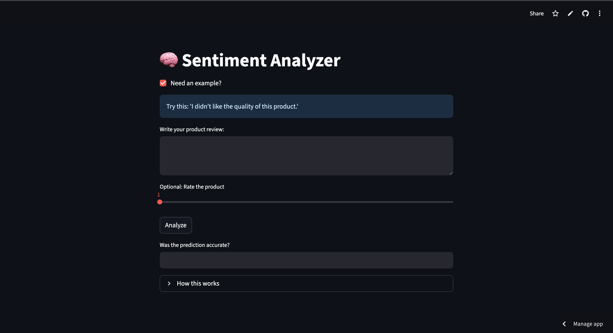
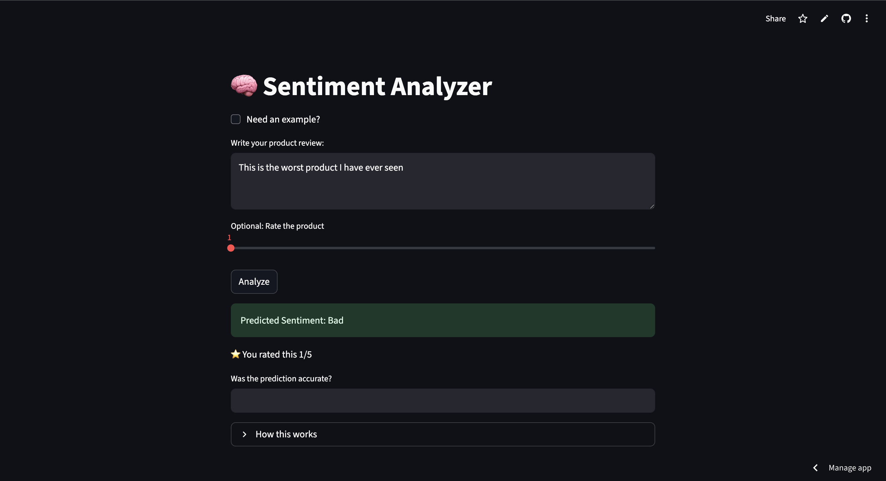

# 🧠 Sentiment Analyzer

The Sentiment Analyzer is a simple Machine Learning project that predicts whether a given text sentiment is Good, Bad or Neutral.  
It uses NLP techniques to process the text and a trained ML model to classify the sentiment.  
The web app is built with Streamlit, making it easy to type or paste text and instantly see the prediction.

## 🚀 Live Demo Link

https://sentiment-analyzer-project-j9fm5mzrv9mzgjvgr5zf5d.streamlit.app/

## 📌 Features

- Input your review text and get instant sentiment prediction  
- Supports longer text inputs  
- Beginner-friendly interface built with Streamlit  
- Uses a pre-trained ML model  

## 🖼️ Screenshots

### Web Interface - Screenshot 1

### Web Interface - Screenshot 2

## 🛠 Tech Stack

- **Python** – Programming language  
- **Scikit-learn** – Model training  
- **Joblib** – Model & vectorizer saving/loading  
- **Streamlit** – Web app framework  

## 📖 How It Works

1. User enters text in the app  
2. The text is converted into numerical features using **TfidfVectorizer**  
3. The ML model predicts sentiment (Positive / Negative / Neutral)  
4. Result is displayed instantly  
